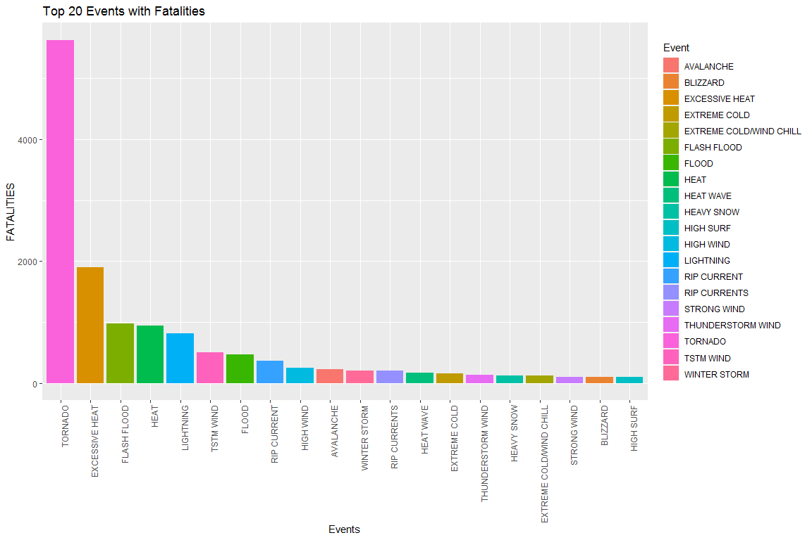
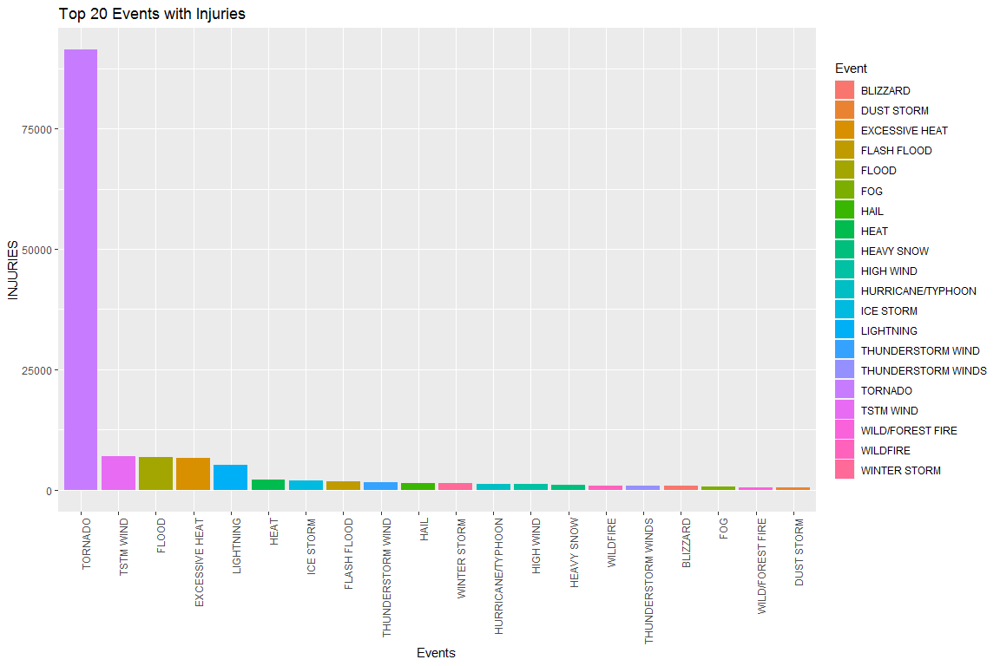
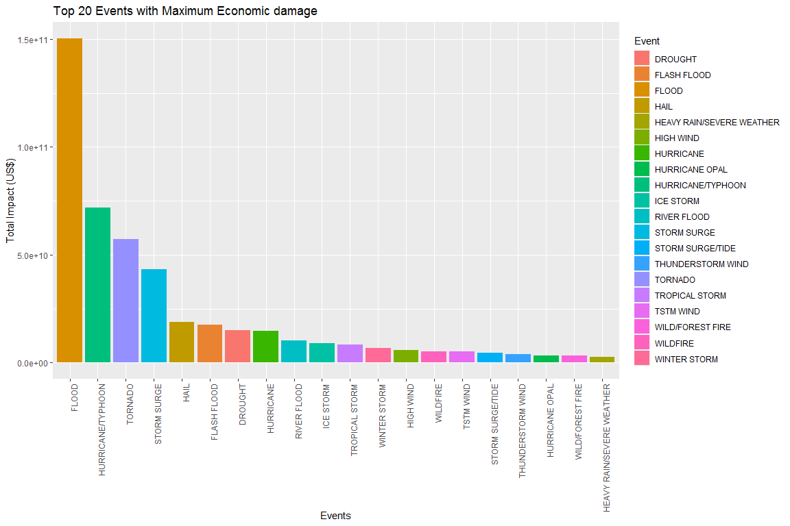

## Abstract

Various Events such as Typhoon, Extreme heat, Floods , Tsunami etc can cause huge losses of life and property. It is hard to prevent these events but we can be prepared and show extra care when we know that the event can cause a large scale damage in terms of human life and economy.

The dataset provided by US National Oceanic and Atmospheric Administraion's (NOAA) storm database consists of records of various events across the years and an estimate to the number of deaths, injuries, property damage estimate and crop damage estimate. This research analyses this data and provides an insight to the events that cause the maximum damage so that allocation of resources during an event might be optimised.

## Reading the Data

If data has not been downloaded then the data can be downloaded from the following link:   
[Storm dataset (47 MB)](https://d396qusza40orc.cloudfront.net/repdata%2Fdata%2FStormData.csv.bz2)   

The file has to be unzipped and stored in the same directory


```r
# To check if file exists in the directory uncomment the below line
# file.exists("repdata_data_StormData.csv")

# Reading the data
data <- read.csv("repdata_data_StormData.csv")
```

Displaying the data


```r
head(data)
```

```
##   STATE__           BGN_DATE BGN_TIME TIME_ZONE COUNTY COUNTYNAME STATE  EVTYPE
## 1       1  4/18/1950 0:00:00     0130       CST     97     MOBILE    AL TORNADO
## 2       1  4/18/1950 0:00:00     0145       CST      3    BALDWIN    AL TORNADO
## 3       1  2/20/1951 0:00:00     1600       CST     57    FAYETTE    AL TORNADO
## 4       1   6/8/1951 0:00:00     0900       CST     89    MADISON    AL TORNADO
## 5       1 11/15/1951 0:00:00     1500       CST     43    CULLMAN    AL TORNADO
## 6       1 11/15/1951 0:00:00     2000       CST     77 LAUDERDALE    AL TORNADO
##   BGN_RANGE BGN_AZI BGN_LOCATI END_DATE END_TIME COUNTY_END COUNTYENDN
## 1         0                                               0         NA
## 2         0                                               0         NA
## 3         0                                               0         NA
## 4         0                                               0         NA
## 5         0                                               0         NA
## 6         0                                               0         NA
##   END_RANGE END_AZI END_LOCATI LENGTH WIDTH F MAG FATALITIES INJURIES PROPDMG
## 1         0                      14.0   100 3   0          0       15    25.0
## 2         0                       2.0   150 2   0          0        0     2.5
## 3         0                       0.1   123 2   0          0        2    25.0
## 4         0                       0.0   100 2   0          0        2     2.5
## 5         0                       0.0   150 2   0          0        2     2.5
## 6         0                       1.5   177 2   0          0        6     2.5
##   PROPDMGEXP CROPDMG CROPDMGEXP WFO STATEOFFIC ZONENAMES LATITUDE LONGITUDE
## 1          K       0                                         3040      8812
## 2          K       0                                         3042      8755
## 3          K       0                                         3340      8742
## 4          K       0                                         3458      8626
## 5          K       0                                         3412      8642
## 6          K       0                                         3450      8748
##   LATITUDE_E LONGITUDE_ REMARKS REFNUM
## 1       3051       8806              1
## 2          0          0              2
## 3          0          0              3
## 4          0          0              4
## 5          0          0              5
## 6          0          0              6
```

## Data Processing

### Loading Required Libraries for processing

Some packages are required to be installed. Then they have to be imported with the following command.


```r
# importing data.table library
# If not installed uncomment the below line first
# install.packages("data.table")
library(data.table)

# importing dplyr library
# If not installed uncomment the below line first
# install.packages("dplyr")
library(dplyr)
```

```
## 
## Attaching package: 'dplyr'
```

```
## The following objects are masked from 'package:data.table':
## 
##     between, first, last
```

```
## The following objects are masked from 'package:stats':
## 
##     filter, lag
```

```
## The following objects are masked from 'package:base':
## 
##     intersect, setdiff, setequal, union
```

### Subsetting the data for events and fatalities

A new dataframe is created by grouping events(EVTYPE) and then applying sum function on fatalities as follows:   

```r
# Grouping on the basis of evtype and applying sum function
fatalities_evtype <- aggregate(FATALITIES~EVTYPE,data,sum)

# Sorting on the basis of fatalities
fatalities_evtype <- arrange(fatalities_evtype,desc(FATALITIES))
```

### Subsettting the data for events and injuries

A new dataframe is created by grouping events(EVTYPE) and then applying sum function on injuries as follows:   

```r
# Grouping on the basis of evtype and applying sum function
injuries_evtype <- aggregate(INJURIES~EVTYPE,data,sum)

# Sorting on basis of injuries(descending)
injuries_evtype <- arrange(injuries_evtype,desc(INJURIES))
```

### Calculation of Property damage and Crop Damage

Individual Property damage and Crop damage is calculated based on the abbrevation given in PROPDMGEXP and CROPDMG column

The description of the abbrevation can be found by clicking [here](https://rstudio-pubs-static.s3.amazonaws.com/58957_37b6723ee52b455990e149edde45e5b6.html)

Abbrevations :

* H,h = Hundreds   = x 100
* K,k = Thousands  = x 1,000
* M,m = Millions   = x 1,000,000
* B,b = Billion    = x 1,000,000,000
* (+) = NA         = x 1
* (-) = NA         = x 0
*  ?  = NA         = x 0
*  "" = NA         = x 0

The following code calculates total damage

```r
# Creating new dataframe with required columns
economy <- data.frame(data$EVTYPE,data$PROPDMG,data$PROPDMGEXP,data$CROPDMG,data$CROPDMGEXP)

# Assigning names to columns
names(economy) <- c("EVTYPE","PROPDMG","PROPDMGEXP","CROPDMG","CROPDMGEXP")

# Getting the abbrevations
Symbol <- sort(unique(as.character(economy$PROPDMGEXP)))

# Creating a vector with values to abbrevations
Multiplier <- c(0,0,0,1,10,10,10,10,10,10,10,10,10,10^9,10^2,10^2,10^3,10^6,10^6)

# Creating a data frame with abbrevations and their values
c.Multiplier <- data.frame(Symbol, Multiplier)

# Matching PROPDMGEXP abbrevation with the one in Symbol list
economy$Prop.Multiplier <- c.Multiplier$Multiplier[match(economy$PROPDMGEXP, c.Multiplier$Symbol)]

# Matching CROPDMGEXP abbrevation with the one in Symbol list
economy$Crop.Multiplier <- c.Multiplier$Multiplier[match(economy$CROPDMGEXP, c.Multiplier$Symbol)]

# Calculating Total Economic damage
economy <- economy %>% mutate(PROPDMG = PROPDMG*Prop.Multiplier) %>% mutate(CROPDMG = CROPDMG*Crop.Multiplier) %>% mutate(Total_damage = PROPDMG+CROPDMG)

# Grouping on the basis of Event and applying sum function
economy <- aggregate(Total_damage~EVTYPE,economy,sum)

# Sorting on basis of Total_damage(Descending)
economy <- arrange(economy,desc(Total_damage))

# Displaying few values
head(economy)
```

```
##              EVTYPE Total_damage
## 1             FLOOD 150319678250
## 2 HURRICANE/TYPHOON  71913712800
## 3           TORNADO  57352117607
## 4       STORM SURGE  43323541000
## 5              HAIL  18757611527
## 6       FLASH FLOOD  17562132111
```

## Results

### Events with Fatalities

Top 20 highest fatality events are shown.


```r
# importing required library
library(ggplot2)

# Plotting graph
# Defining x,y and fill bars on the basis of Event Type
g <- ggplot(fatalities_evtype[1:20,],
            aes(reorder(EVTYPE,-FATALITIES),
                FATALITIES,
                fill=EVTYPE))

# Plotting a bargraph
g+geom_bar(stat="identity")+
  
  # Defining labels
  labs(x="Events",
       title = "Top 20 Events with Fatalities",
       fill="Event")+
  
  # Defining theme
  theme(axis.text.x =element_text(angle = 90,hjust = 1))
```

<!-- -->

Tornado caused the maximum deaths with 5633 deaths.

### Events with Injuries

Top 20 highest injury causing events are shown.


```r
# Plotting graph
# Defining x,y and fill bars on the basis of Event Type
g <- ggplot(injuries_evtype[1:20,],
            aes(reorder(EVTYPE,-INJURIES),
                INJURIES,
                fill=EVTYPE))

# Plotting a bargraph
g+geom_bar(stat="identity")+
  
  # Defining labels
  labs(x="Events",
       title = "Top 20 Events with Injuries",
       fill="Event")+
  
  # Defining theme
  theme(axis.text.x =element_text(angle = 90,hjust = 1))
```

<!-- -->

Tornado caused the maximum injuries with 9.1346\times 10^{4} injuries.

### Events with Maximum Economic Damage

Top 20 highest ecomomy impact events are shown.


```r
# Plotting graph
# Defining x,y and fill bars on the basis of Event Type
g <- ggplot(economy[1:20,],
            aes(reorder(EVTYPE,-Total_damage),
                Total_damage,
                fill=EVTYPE))

# Plotting a bargraph
g+geom_bar(stat="identity")+
  
  # Defining labels
  labs(x="Events",
       y="Total Impact (US$)",
       title = "Top 20 Events with Maximum Economic damage",
       fill="Event")+
  
  # Defining theme
  theme(axis.text.x =element_text(angle = 90,hjust = 1))
```

<!-- -->

Flood caused the maximum economic impact with overall loss of 1.5031968\times 10^{11} dollars.
